# 1 若依（前后端分离版）

## 1.1 什么是若依？

开源项目，学习开源项目的目标：

1、用，减少自己的工作量

2、学习优秀开源项目底层的编程思想，设计思路，提高自己的编程能力

官网：[http://www.ruoyi.vip/ ](http://www.ruoyi.vip/)

基础：Spring Boot + Vue

环境要求：

1、JDK 1.8+

2、MySQL 5.7+

3、Redis 3+

4、Maven 3.0+

5、Vue（Node >= 12）

## 1.2 使用若依

使用开源项目的步骤：

1、下载并运行

2、看懂业务流程

3、进行二次开发下载：

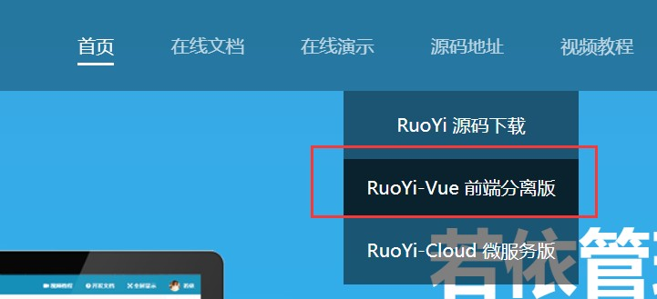

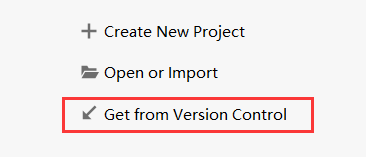

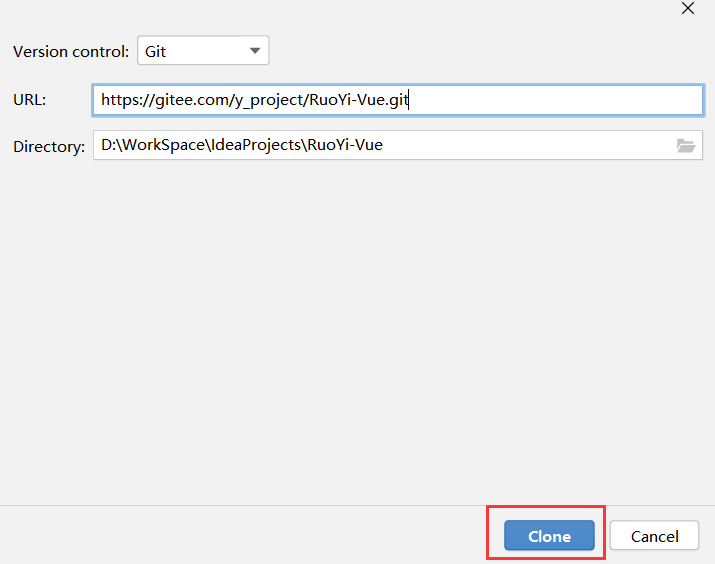

* 配置数据库 MySQL、Reids

  本地执行 SQL 脚本

  在工程中配置数据库
  
  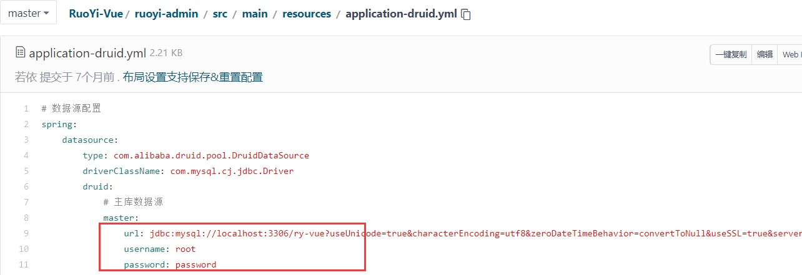

Redis 配置

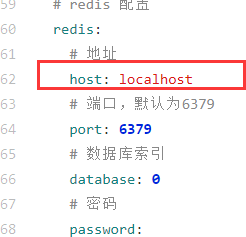


启动前端：

1、安装依赖 npm install 

2、启动 npm run dev

## 1.3 登录

### 1.3.1 生成验证码

> 基本思路

后端生成一个表达式，1+1=2

1+1=?@2

1+1=? 转成图片，传到前端进行展示

2 存入 Reids

http://localhost/dev-api/captchaImage 前端

Vue 获取图片，前端还是后端？

反向代理，url 请求前端，进行代理，映射到后端，解决跨越问题

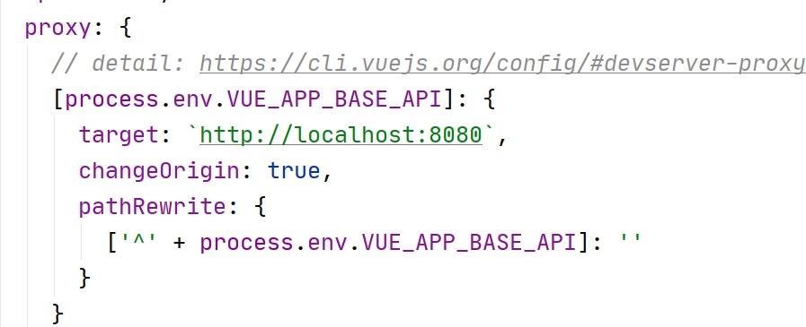

```
/dev-api 替换成'' 再映射到
http://localhost:8080
```

http://localhost:8080/captchaImage

后端代码

### 1.3.2   登录的具体流程

后端：

1、校验验证码

2、校验用户名和密码

3、生成 Token

使用异步任务管理器，结合线程池，实现了异步的操作日志记录，和业务逻辑实现异步解耦合。

### 1.3.3 getInfo

获取当前用户的角色和权限信息，存储到 Vuex 中

```
*:*:*
```

### 1.3.4 getRouters

根据当前用户的权限获取动态路由

## 1.4 用户管理


流程：加载 Vue 页面 -》请求后台数据1、getList


1、startPage()

PageHelper 中的 reasonable 对参数进行逻辑处理，保证参数的正确性，

pageNum = 0/-1，pageNum = 1

2、userService.selectUserList(user);

注解 @DataScope(deptAlias = "d", userAlias = "u")

给表设置别名的，sys_dept d，sys_user u

2、treeselect

（1） 查出所有的部门数据

（2） 组装成树状结构

buildDeptTreeSelect：将 10 条记录组装成一个树状图

recursionFn(depts, dept);

1、先找到顶级节点，找到它的子节点

2、遍历顶级节点的子节点，再找到它的子节点

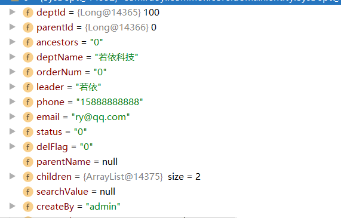

 

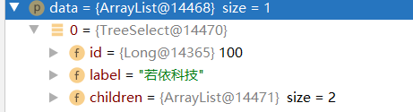

点击树状图中的数据

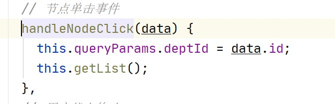

## 1.5 添加数据

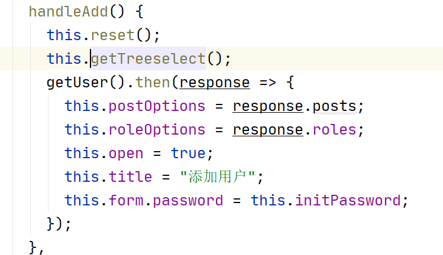


reset 是表单重置

getTreeselect 获取部门树状图

getUser 获取角色和部门信息后端 

User 业务

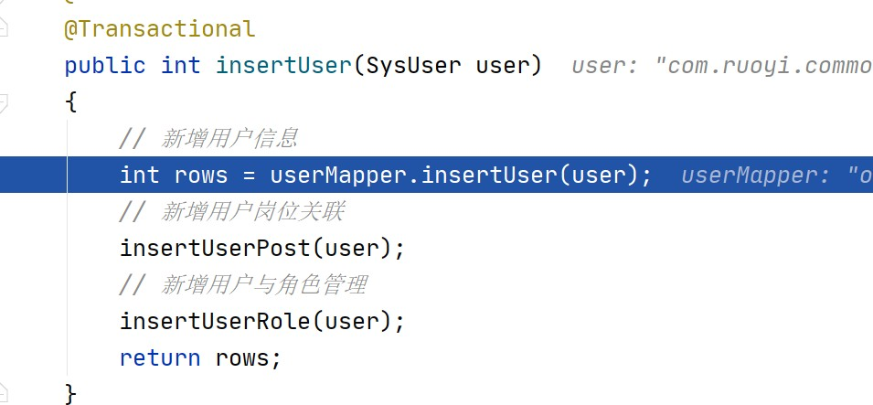

## 1.6 修改数据

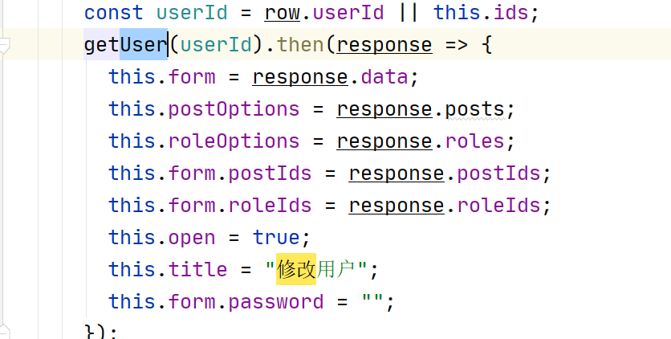

这里的 getUser 方法除了要获取所有的岗位和角色信息之外，还要获取当前用户已经拥有的岗位和角色。

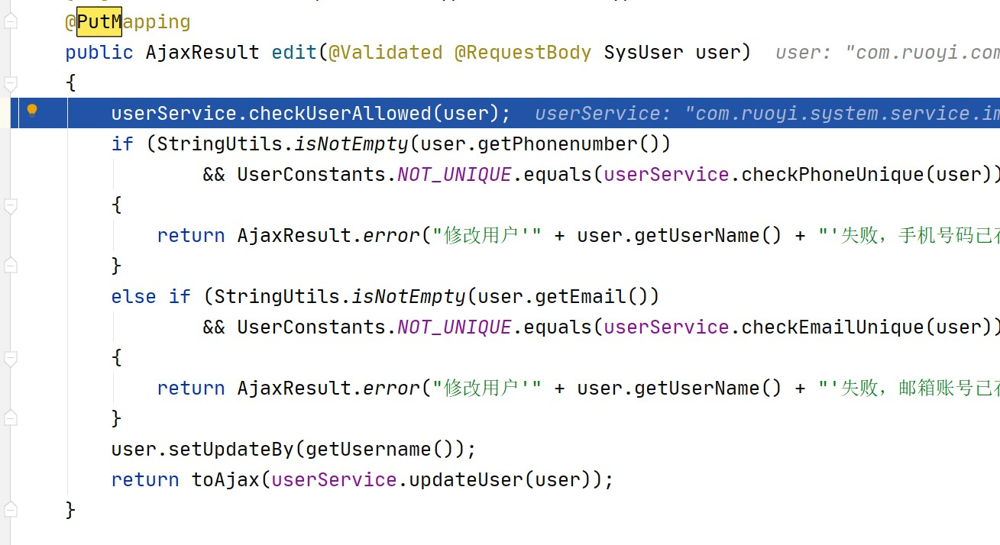


数据库：

1、修改 user

2、重新维护 user_post 和 user_role

## 1.7 删除数据

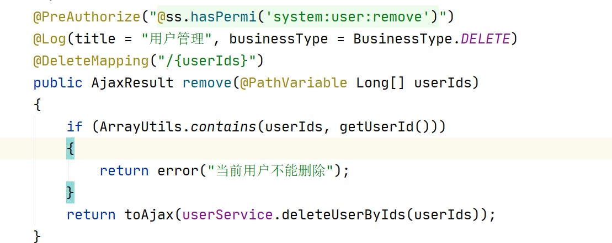

## 1.8 异步任务管理器

```java
AsyncManager.me().execute(
    	AsyncFactory.recordLog ininfor(username, Constants.LOGIN_FAIL, 
                                       MessageUtils.message("user.password.not.match")));
```

通过异步任务管理器记录登录日志

1、AsyncManager.me() 获取一个 AsycnManager 对象

2、执行 execute 方法，执行任务，传入的是一个 Task 对象，实现了 Runnable 接口，是一个任务，由线程Thread 去执行

```java
    public static TimerTask
    recordLogininfor(final String username,
                     final String status, final String message,
                     final Object... args) {
        final UserAgent userAgent =
                UserAgent.parseUserAgentString(ServletUtils.getRequest().getHeader("User-Agent"));
        final String ip = IpUtils.getIpAddr(ServletUtils.getRequest());
        return new TimerTask() {
            @Override
            public void run() {
                String address = AddressUtils.getRealAddressByIP(ip);
                StringBuilder s = new StringBuilder();
                s.append(LogUtils.getBlock(ip));
                s.append(address);
                s.append(LogUtils.getBlock(username));
                s.append(LogUtils.getBlock(status));
                s.append(LogUtils.getBlock(message));
				// 打印信息到日志
                sys_user_logger.info(s.toString(), args);
				// 获取客户端操作系统
                String os = userAgent.getOperatingSystem().getName();
                // 获取客户端浏览器
                String browser = userAgent.getBrowser().getName();
				// 封装对象
                SysLogininfor logininfor = new SysLogininfor();
                logininfor.setUserName(username);
                logininfor.setIpaddr(ip);
                logininfor.setLoginLocation(address);
                logininfor.setBrowser(browser);
                logininfor.setOs(os);
                logininfor.setMsg(message);
				// 日志状态
                if (StringUtils.equalsAny(status,
                        Constants.LOGIN_SUCCESS, Constants.LOGOUT,
                        Constants.REGISTER)) {
                    logininfor.setStatus(Constants.SUCCESS);
                } else if (Constants.LOGIN_FAIL.equals(status)) {
                    logininfor.setStatus(Constants.FAIL);
                }
				// 插入数据
                SpringUtils.getBean(ISysLogininforService.class).insertLogininfor(logininfor);
            }
        };
    }
```

封装了登录用户的信息，执行添加操作，这里不会执行，而是将任务交给线程对象来执行。

异步任务管理器，内部定义了一个线程池，然后根据业务创建添加日志的任务，交给线程池来处理，这样做到日志和业务的抽象，解耦合，日志全部统一处理。

## 1.9 代码自动生成

1、创建数据表

```sql
use ruoyi_vue;
create table test_user(
	id int primary key auto_increment,
	name varchar(11),
	password varchar(11)
);
```


2、系统工具 -》代码生成


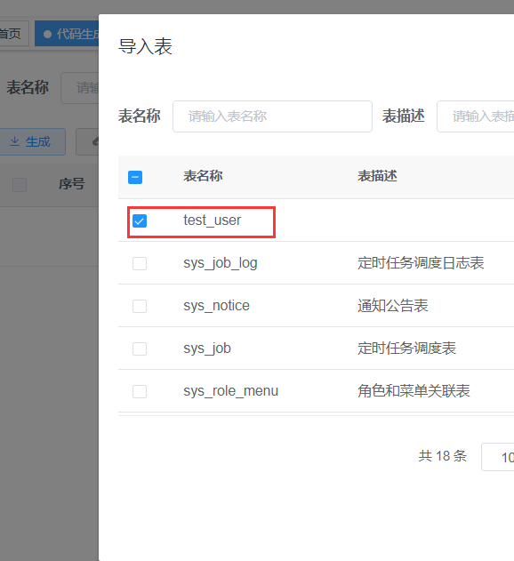

 

3、编辑

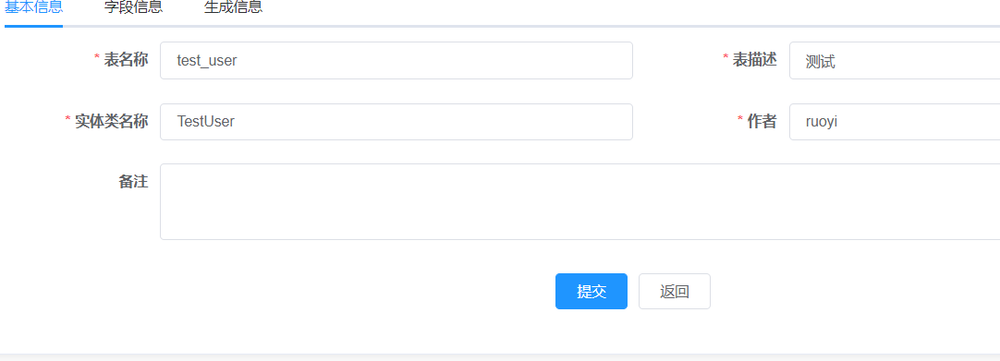

 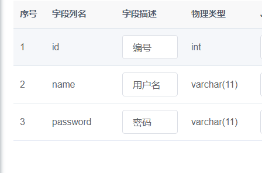

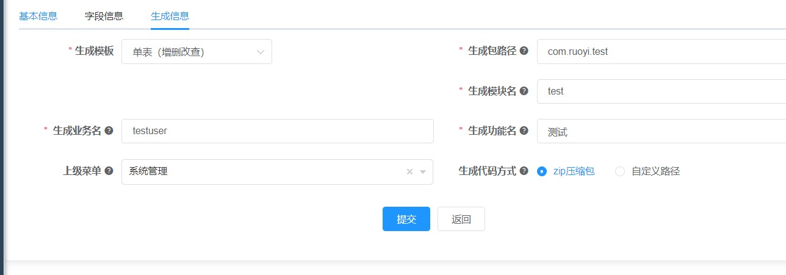

4、点击生成代码


5、解压

main（Java 后端代码） 

vue（Vue 前端代码） 

SQL（菜单 SQL）

6、导入代码，重启项目

如果后端抛出 404 异常，rebuild project，重新启动即可


 

